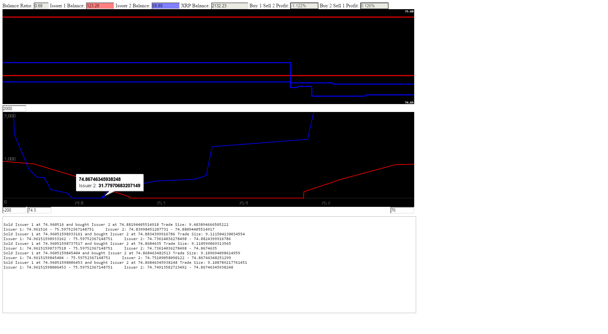

Trading bot for the [Ripple](https://ripple.com/) network.
Automatically searches for and trades mispricings between issuers on the configured currency.

<h3>Installation</h3>
Required NPM Packages:
express, socket.io, body-parser, cookie-parser, debug, morgan, serve-favicon

<h3>Usage</h3>
Usage: node ./bin/www [config name] [port number]

Example: node ./bin/www config 8000

You will need to have a file named config.js (or [config name].js) in the configs directory.

<h3>UI</h3>

The streaming plot at the top shows a stream of the bid ask spreads for the currency and issuers selected in the config file.  The spread for each issuer is shown in a different color.

The bottom chart shows the full book for the currency and issuers selected in the config file.  The x axis is the price in units of XRP per 1 unit of the selected currency.  The y-axis represents the cumulative volume of the book.  

You can adjust the x and y window displayed in the chart by entering xmin, xmax, ymin, and ymax values in the provided text boxes.  Note that the chart will automatically update the view based on the entered values every time a new book is read.  Usually every few seconds.

<b>Use at your own risk.  I'm not responsible for any losses you might incur by using this bot.</b>

